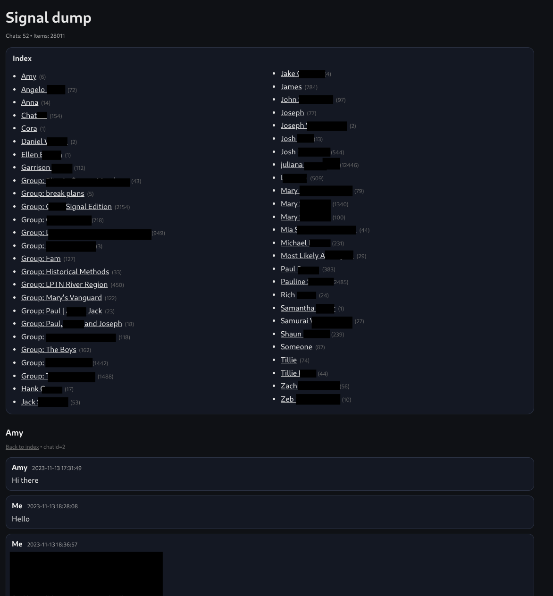

# S.A.E. (signalapp-exporter) 

A Python script to conveniently export Signal chats!!

**Disclaimer**

The power behind Signal is in the encryption. Exporting your data from Signal and using this script decrypts your messages and attachments, making them potentially vulnerable. Do your due diligence to protect any archives you create.  

---

### Features of S.A.E. and what it archives:
- Index of contacts
- Chat / Message count
- Groups
- Gravestones for deleted messages
- Reactions
- Attachment support (Can only be viewed through the html output)
- Calls

---

### How to use:
1. Download the Signal desktop app
2. Go to *Settings* < *Chats* < *Export Chat History*
3. Export your chat history:
    - You ought to have an export directory
    - Inside that export directory are *main.jsonl*, *metadata.json*, and a *files* directory for attachments

4. Inside your export directory, execute SAE-v7.py
    - Nothing should need to be configured
    - An html and txt file will be generated with all your messages. View a clean transcript with attachments in your web browser or plain-text in a text editor

---

